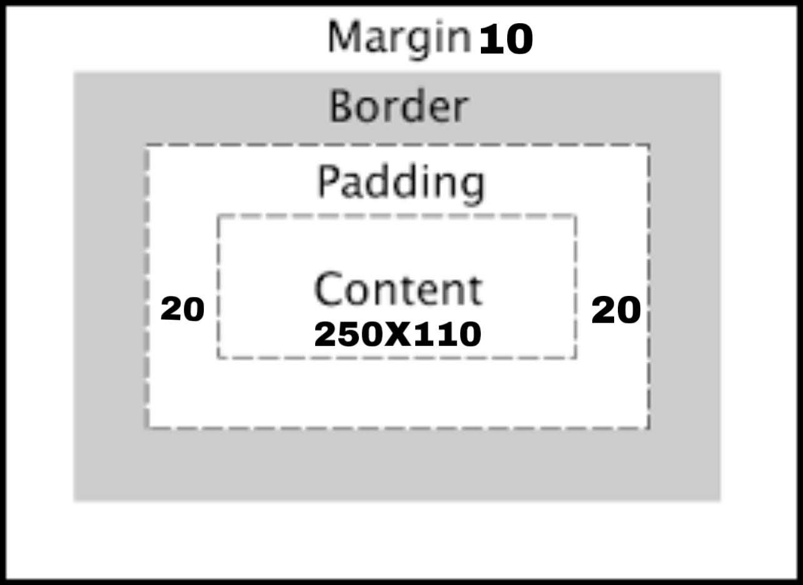

##Snap Challenge 
Number 1

    function countNumbers (arrayOfNumbers){
        let counterArray= []
        arrayOfNumbers.foreach((numberFromArray) => counterArray[numberFromArray] = counterAray[numberFromArray] ? 
        counterArray[numberFromArray] +1:1)
        return counterArray
    }
    console.log(countNumbers([3,2,3,5,4,3,5]))
    

#Number 2
    
    (let i;)
	for (i=1; i<=100; i++)
	{
		if (i%2 == 0 && (i%3) == 0)
			document.write("baz");
		else if ((i%2) == 0)
			document.write("Fizz");
		else if ((i%3) == 0)				
			document.write("Buzz");
			document.write(i);			
	}
#Marty's Answer
    Function fizzBuzz (number1, number2){
        const largerNumber = number1 > number2 ?
        const smallerNumber = number1 > number2 ? number2 : number1

        for(let i = smallerNumber; i <= largerNumber; i++){
            let output = ''
            if(i % 2 === 0 && i % 3){
                console.log('baz')
            }else{
                if (i% 2 === 0){
                    console.log('fizz')
                }
                if (i % 3 === 0) {
                    console.log('buzz')
                }
            }
        }
    }
    fizzBuzz(5,30)

Number 3

